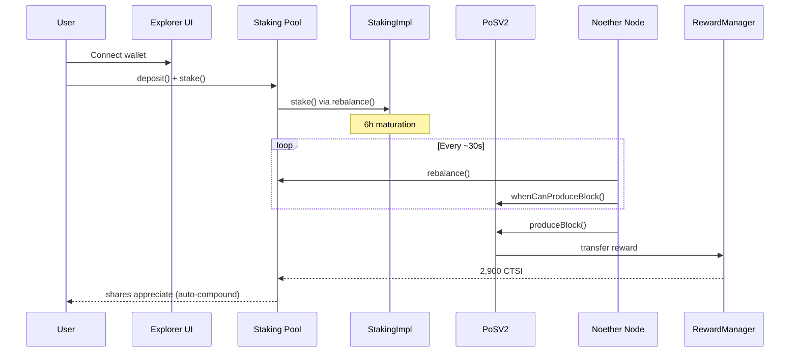

# Architecture Overview

How the CTSI PoS system works end to end — from a user staking CTSI to a block being produced and rewards distributed.

## High-level flow



## On-chain contract architecture

The PoS contracts (pos-dlib) form a layered system:

```
┌──────────────────────────────────────────────┐
│                  PoSV2Impl                    │
│  produceBlock(), whenCanProduceBlock()        │
├──────────────┬───────────────┬───────────────┤
│ Eligibility  │  Difficulty   │ RewardManager │
│ (selection)  │  (adjustment) │  (payout)     │
├──────────────┴───────────────┴───────────────┤
│              StakingImpl                      │
│  stake(), unstake(), withdraw()               │
├──────────────────────────────────────────────┤
│           WorkerAuthManager                   │
│  hire(), retire() — links owner ↔ worker      │
└──────────────────────────────────────────────┘
```

For staking pools, an additional layer wraps the PoS contracts:

```
┌──────────────────────────────────────────────┐
│           StakingPoolImpl (facets)            │
│  User │ Staking │ Worker │ Mgmt │ Producer   │
├──────────────────────────────────────────────┤
│         Commission (FlatRate / GasTax)        │
├──────────────────────────────────────────────┤
│     PoSV2 + StakingImpl (pos-dlib)            │
└──────────────────────────────────────────────┘
```

## Off-chain node architecture

The Noether node is a long-running process that bridges Ethereum and block production:

```
┌─────────────────────────────────────────┐
│              Noether Node               │
│                                         │
│  ┌─────────┐  ┌──────────┐  ┌────────┐ │
│  │ Wallet  │  │ PoS      │  │ Pool   │ │
│  │ Manager │  │ Client   │  │ Client │ │
│  └────┬────┘  └────┬─────┘  └───┬────┘ │
│       │            │            │      │
│  ┌────▼────────────▼────────────▼────┐ │
│  │         Worker Loop                │ │
│  │  poll eligibility → produceBlock   │ │
│  │  poll pool → rebalance             │ │
│  └────────────────┬───────────────────┘ │
│                   │                     │
│  ┌────────────────▼───────────────────┐ │
│  │   Gas Price Provider               │ │
│  │   (eth-provider / gas-station)       │ │
│  └────────────────┬───────────────────┘ │
└───────────────────┼─────────────────────┘
                    │ JSON-RPC
                    ▼
            Ethereum Node (Infura, Alchemy, etc.)
```

## Data flow for the explorer

```
Ethereum mainnet
      │ events
      ▼
  subgraph (The Graph)
      │ GraphQL
      ▼
  explorer UI  ←── direct RPC for transactions
      │
      ▼
  User wallet (MetaMask)
```

The explorer reads aggregated data (pool performance, block history, user stakes) from the subgraph. Wallet transactions (deposit, stake, hire node) go directly to Ethereum via the user's wallet.

## Selection algorithm (conceptual)

Block producer selection is **not** a simple lottery. It uses a weighted exponential distribution:

1. After each block, a future Ethereum block hash `H` becomes available as a randomness source.
2. Each staker `i` with balance `b_i` computes a personal eligibility time `T_i` from `H` and `b_i`.
3. The first staker whose eligibility time has passed can call `produceBlock()`.
4. Higher stake → shorter expected wait → higher probability of winning the race.

Difficulty adjusts after each block to keep the average interval stable as total staked balance changes. If total stake doubles, difficulty doubles to maintain the same block rate.

## Deployment topology (production)

| Component | Where it runs |
| --- | --- |
| PoS contracts | Ethereum mainnet (immutable, upgradeable via factory pattern) |
| Staking pool contracts | Ethereum mainnet (cloned from factory per pool) |
| Noether node | Operator's VPS / server (Docker) |
| Subgraph | The Graph hosted service / decentralized network |
| Explorer | Vercel (CDN + serverless) |

## Local development topology

For integration testing, all layers can run locally:

1. **Hardhat node** — `staking-pool` or `pos-dlib` deploys all contracts to localhost:8545
2. **Graph node** — Docker Compose indexes localhost chain
3. **Subgraph** — deployed to local Graph node
4. **Noether** — `yarn start` against localhost
5. **Explorer** — `yarn dev` with `.env.development.local` pointing to localhost

This is the setup described in the explorer and noether READMEs.
