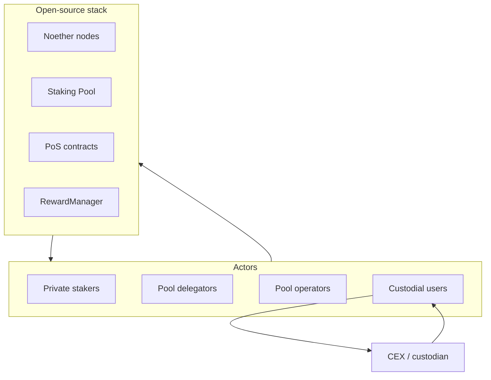

# Introduction to CTSI Staking

## What is CTSI staking?

CTSI (Cartesi Token) staking is Cartesi's Proof of Stake mechanism. Token holders lock CTSI on Ethereum mainnet to gain the right to produce blocks on **Noether**, Cartesi's sidechain. Block producers earn CTSI rewards drawn from Cartesi's **Mine Reserve**.

The system runs entirely on top of Ethereum. Every staking action, block claim, and reward payout is an on-chain transaction on Ethereum (or a supported testnet). The Noether node is off-chain software that watches the PoS contracts and submits transactions when its owner is eligible to produce a block.

## Bird's-eye view

Private stakers, delegators, and operators participate through the on-chain PoS stack and Noether nodes. Custodial users stake outside this stack via centralized providers.

## How block production works (simplified)

1. Users stake CTSI through the `StakingImpl` contract on Ethereum.
2. A weighted random selection algorithm determines which staker is eligible to produce the next block. Higher stake = higher probability.
3. The eligible staker's **worker** (Noether node) calls `produceBlock()` on the PoS contract.
4. The `RewardManager` pays a fixed reward (currently **2,900 CTSI per block**) to the staker.
5. Difficulty adjusts automatically to keep the average block interval stable as total staked balance changes.

Blocks on Noether are currently empty — the sidechain exists as a reward mechanism, not as an execution environment for applications. This is distinct from Cartesi Rollups, which run application logic inside the Cartesi Machine.

## Three ways to participate

### 1. Delegate to a public pool (most common)

Users deposit CTSI into a **staking pool** smart contract and receive pool shares. A pool operator runs a Noether node on behalf of all delegators. Rewards are auto-compounded; the operator takes a commission.

- **Who runs the node:** Pool operator
- **Who pays ETH gas:** Pool operator (for block production and pool maintenance); users pay gas for their own deposit/stake/unstake transactions
- **Entry point:** [explorer.cartesi.io](https://explorer.cartesi.io) → Stake → pick a pool

### 2. Run a private node (direct staking)

Users stake CTSI directly and run their own Noether node. The node acts as the worker for their stake. Suitable for larger stakes and operators willing to monitor a node 24/7.

- **Who runs the node:** The staker
- **Who pays ETH gas:** The staker (via the node's wallet)
- **Entry point:** [explorer.cartesi.io](https://explorer.cartesi.io) → Node Runners → Create My Node
- **Guide:** [Running a Node and Staking](https://medium.com/cartesi/running-a-node-and-staking-42523863970e) - older step-by-step walkthrough; still useful for Docker setup, wallet creation, and hiring your node

### 3. Third-party custodial services

Centralized exchanges and custodians (e.g. Binance, CoinOne, MyCointainer) offer CTSI staking outside this open-source stack. Each service has its own rules, fees, and custody model.

## Economics

| Item                  | Value / note                                                  |
| --------------------- | ------------------------------------------------------------- |
| Block reward          | ~2,900 CTSI per block                                         |
| Reward source         | Cartesi Mine Reserve                                          |
| Staking maturation    | ~6 hours before new stake counts toward selection             |
| Unstaking maturation  | ~48 hours before tokens can be withdrawn                      |
| Slashing              | None currently — principal is never at risk from node failure |
| Hardware requirements | Minimal — selection probability depends on stake, not compute |

## Costs to consider

Participating in staking involves Ethereum gas costs:

- **Stakers (direct):** ETH to fund the node's wallet for hiring and block production
- **Stakers (pools):** ETH for deposit, stake, unstake, and withdraw transactions to the pool contract
- **Pool operators:** ETH for node operation plus pool maintenance (rebalance, stake/unstake on PoS contracts on behalf of users)

There is no minimum CTSI stake enforced by the protocol, but gas costs make very small stakes impractical for direct node operation. Delegating to a pool is usually better for smaller amounts.

## Supported networks

| Network                        | Status                    |
| ------------------------------ | ------------------------- |
| Ethereum mainnet               | Production                |
| Sepolia testnet                | Supported                 |
| Local Hardhat (chain ID 31337) | Dev / integration testing |

Goerli and other legacy testnets have been removed from recent deployments.