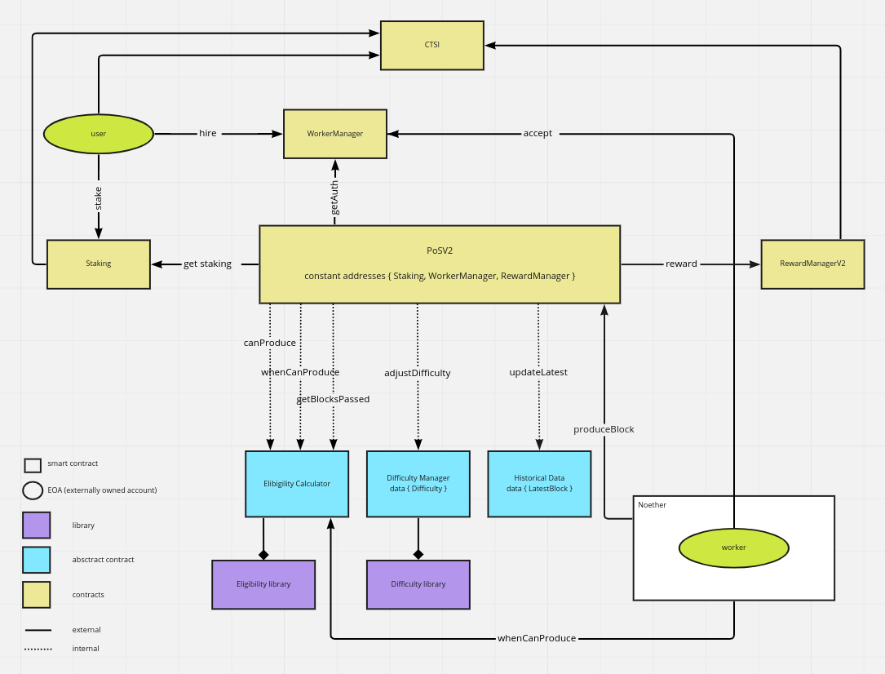
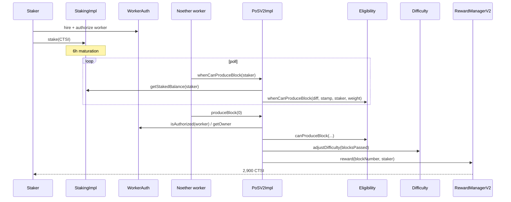

# pos-dlib — Core Proof of Stake contracts

High-level tour of [cartesi/pos-dlib](https://github.com/cartesi/pos-dlib) (published as `@cartesi/pos`). 

This is the **on-chain core** of CTSI staking: who has stake, who is eligible to produce the next Noether block, how difficulty moves, and how CTSI rewards are paid. Pool contracts, the Noether node, the explorer, and the subgraph all sit *around* this library. They are not in this repo.

Per-function and algorithm depth is deferred to later deep dives.

## What it does

pos-dlib implements a **weighted random lottery** over CTSI stakers. Probability of being selected is proportional to staked balance. The selected staker's **worker** (Noether node) claims the win by sending an Ethereum transaction. A **RewardManager** then pays a CTSI prize from the Mine Reserve.

The lottery runs on Ethereum. Noether “blocks” are records on these contracts, not a separate consensus network. Today those blocks are empty — the chain exists as a reward mechanism.

Two protocol generations live in the same repo:

| | PoS v1 | PoS v2 (current code) |
| --- | --- | --- |
| Solidity | 0.7 | 0.8 |
| Orchestrator | `PoS` | `PoSV2Impl` (deployed by `PoSV2FactoryImpl`) |
| Selection + difficulty | `BlockSelector` (combined) | `Eligibility` + `Difficulty` libraries |
| Rewards | `RewardManager` (balance-proportional, bounded) | `RewardManagerV2Impl` (fixed 2,900 CTSI) |
| History | Block count on `BlockSelector` | `HistoricalDataImpl` (v2 can store a parent/data tree) |
| Compatibility | Original production | Factory can deploy **v1-compatible** or **v2** mode |

Production staking uses PoS v2 contracts in **v1-compatible mode** (`version == 1`): same `produceBlock(uint256)` signature the pools and Noether already call, but with the modular v2 internals.

The repo's own overview of that v1-compatible layout:



## Component map

```
                    ┌──────────────────────────────────────────┐
                    │           PoSV2FactoryImpl               │
                    │     createNewChain(...) → PoSV2Impl      │
                    └──────────────────┬───────────────────────┘
                                       │ deploys
                    ┌──────────────────▼───────────────────────┐
                    │                PoSV2Impl                 │
                    │  produceBlock / canProduceBlock / …      │
                    │  inherits EligibilityCal + DifficultyMgr │
                    │           + HistoricalData               │
                    └───┬──────────┬──────────┬───────────┬────┘
                        │          │          │           │
           getStaked    │          │          │           │  reward()
           Balance      │          │          │           │
              ┌─────────▼──┐  ┌────▼─────┐  ┌─▼────────┐  ┌▼───────────────┐
              │ StakingImpl│  │Eligibility│  │Difficulty│  │RewardManagerV2 │
              │ (CTSI lock)│  │ library   │  │ library  │  │ (pays CTSI)    │
              └──────▲─────┘  └───────────┘  └──────────┘  └────────────────┘
                     │
              CTSI ERC-20
              0x4916…d06b5D

              ┌──────────────────────────────┐
              │ WorkerManagerAuthManagerImpl │  ← from @cartesi/util, not this repo
              │ hire / authorize / getOwner  │
              └──────────────▲───────────────┘
                             │ isAuthorized(worker, pos)
                      Noether node wallet
```

Shared **external** pieces pos-dlib depends on:

| Package | Role |
| --- | --- |
| `@cartesi/token` | CTSI ERC-20 |
| `@cartesi/util` | `WorkerAuthManager` / `WorkerManagerAuthManagerImpl`, `UnrolledCordic` (log), `Bitmask` |
| `@cartesi/tree` | Parent-tree for v2 historical blocks |
| OpenZeppelin | `Ownable`, `SafeMath` / `SafeERC20` |

## Contracts

### `StakingImpl` — the stake ledger

The only contract that **holds user CTSI** for direct staking. Pools are themselves users of this contract.

Each address has three buckets:

| Bucket | Counts toward selection? | Meaning |
| --- | --- | --- |
| **Maturing** | After `timeToStake` (~6h on mainnet) | Newly staked tokens waiting to become active |
| **Staked** | Yes | Active weight in the lottery |
| **Releasing** | No | Unstaked tokens waiting `timeToRelease` (~48h) before `withdraw` |

Public surface:

- `stake(amount)` — pull CTSI (or recycle releasing balance), start/reset maturation
- `unstake(amount)` — drop weight immediately; start/reset the 48h release clock
- `withdraw(amount)` — send matured releasing tokens back to the caller
- `getStakedBalance(user)` — staked + *already matured* maturing tokens

Resetting the clocks when you stake/unstake again is intentional (and easy to miss). See [Key Concepts](./key-concepts.md#maturation-periods).

Mainnet: [`0x9EdEAdFDE65BCfD0907db3AcdB3445229c764A69`](https://etherscan.io/address/0x9EdEAdFDE65BCfD0907db3AcdB3445229c764A69).

### `PoSV2Impl` — the orchestrator

This is the contract Noether talks to. It does **not** hold stake. On each `produceBlock` it:

1. Checks the caller is an authorized **worker** for some owner (`WorkerAuthManager`).
2. Reads that owner's `getStakedBalance`.
3. Asks **Eligibility** whether that owner can produce *now*.
4. Asks **Difficulty** to retarget based on how many L1 blocks passed.
5. Records history and tells **RewardManagerV2** whom to pay (v1-compatible path pays immediately).

Two entry points, selected by the `version` immutably set at deploy:

- `produceBlock(uint256)` — v1-compatible; unused `uint256` keeps the old ABI. Emits `BlockProduced` and calls `rewardManager.reward(blockNumber, user)`.
- `produceBlock(uint32 parent, bytes data)` — v2 mode; appends a parent-linked sidechain block. Rewards are claimed later via `RewardManagerV2.reward(uint32[])` after a confirmation delay.

Read APIs used by the node: `whenCanProduceBlock(user)`, `canProduceBlock(user)`, `getEthBlockStamp()`, `getLastProducer()`, `getSidechainBlockCount()`.

The factory owner can `terminate()` a chain only after the RewardManager is empty.

### `PoSV2FactoryImpl` — chain factory

Owner-only `createNewChain(...)` deploys a fresh `PoSV2Impl` (which itself deploys its `RewardManagerV2Impl`) and transfers ownership to the factory owner.

Parameters include staking address, worker-auth address, difficulty bounds, target interval (~138 L1 blocks ≈ 30 minutes), reward value (`2900e18` CTSI), reward delay (v2 claim confirmations), and `version`.

Mainnet factory: [`0xEC85600BD0415F1077d8EE77a1abC22dfe1eCf2a`](https://etherscan.io/address/0xEC85600BD0415F1077d8EE77a1abC22dfe1eCf2a).

### `Eligibility` / `EligibilityCalImpl` — who may produce

Library math, inherited into `PoSV2Impl` through `EligibilityCalImpl`.

After each produced block, a future Ethereum block hash (offset **+40** blocks) becomes the randomness seed `H`. Each staker `i` with balance `b_i` gets a personal wait `T_i`:

\[
T_i = \frac{\text{difficulty}}{b_i}\,(256 - \log Y_i)
\quad\text{where}\quad Y_i = \mathrm{hash}(a_i, H)
\]

The first staker whose `T_i` has elapsed may call `produceBlock`. Higher stake → shorter expected wait. Zero stake or “seed not yet available” returns `UINT256_MAX`.

The seed is taken from a *future* L1 block so a producer cannot easily grind eligibility. A main-chain miner can still bias `H`; the original design treats that as acceptable because prizes are small relative to Ethereum block rewards.

Mainnet library: [`0xDC8Cc4d7C37eb99AbD34bdD265d4359B2A7a02e7`](https://etherscan.io/address/0xDC8Cc4d7C37eb99AbD34bdD265d4359B2A7a02e7).

### `Difficulty` / `DifficultyManagerImpl` — interval regulator

After every successful produce, difficulty is nudged toward a **target interval** (in L1 blocks):

- Interval *shorter* than target → difficulty **up** (lottery harder / slower).
- Interval *longer* than target → difficulty **down**, floored at `minDifficulty`.

Step size is `difficulty * difficultyAdjustmentParameter / 1e6`. Expected wait scales as `difficulty / total_stake`, so if total stake doubles, difficulty must roughly double to keep the same block rate.

Mainnet library: [`0x65A28f07B7CE473c3C4535D896fc2bE77b3824B9`](https://etherscan.io/address/0x65A28f07B7CE473c3C4535D896fc2bE77b3824B9).

### `RewardManagerV2Impl` — payout

Deployed *by* `PoSV2Impl`. Holds CTSI (funded from the Mine Reserve). Only the PoS contract may trigger v1-style `reward(blockNumber, address)`.

- **v1-compatible:** pay `min(rewardValue, balance)` immediately to the owner (not the worker). `rewardValue` defaults to **2,900 CTSI**.
- **v2 mode:** caller later claims an array of sidechain block numbers. Each block must pass `isValidBlock` (on the canonical tree, deep enough) and must not already be marked rewarded (`Bitmask`).

### `HistoricalDataImpl` — sidechain memory

Tracks `ethBlockStamp`, `lastProducer`, `sidechainBlockCount`. In v2 mode it also stores per-block data and a parent tree (`@cartesi/tree`) so a later claim can prove a block is on the canonical branch.

### Worker auth (`@cartesi/util`)

Not implemented in pos-dlib, but every produce path depends on it. `WorkerManagerAuthManagerImpl` on mainnet: [`0x832D9f06970ddAc7BA49Be5a2cCad8f89Df74C13`](https://etherscan.io/address/0x832D9f06970ddAc7BA49Be5a2cCad8f89Df74C13).

It binds **owner** (staker / pool) ↔ **worker** (Noether wallet): `hire`, `acceptJob`, `authorize(worker, dapp)`, `retire`. `PoSV2Impl._produceBlock` requires `isAuthorized(msg.sender, factory)` or `isAuthorized(msg.sender, this)`, then pays `getOwner(msg.sender)`.

### Legacy v1 (`PoS`, `BlockSelector`, `RewardManager`)

Still in the tree and still deployed:

- `PoS` — instantiator that holds many chain instances; `produceBlock(index)` delegates to `BlockSelector` then `RewardManager`.
- `BlockSelector` — selection **and** difficulty in one contract (pre-modular design).
- `RewardManager` — decaying prize: a fraction of remaining balance, clamped between min and max (max still 2,900 CTSI).

Mainnet `PoS`: [`0x20516624DE3cbE267a514fE91c31477369524fcE`](https://etherscan.io/address/0x20516624DE3cbE267a514fE91c31477369524fcE). Mainnet `BlockSelector`: [`0x98d951e9b0c0bb180f1b3ed40dde6e1b1b521cc1`](https://etherscan.io/address/0x98d951e9b0c0bb180f1b3ed40dde6e1b1b521cc1).

`BlockSelectorV2.sol` exists as an intermediate v1-era selector; current v2 uses the Eligibility/Difficulty split instead.

## How they interact (one block)

Private node: the staker owns both the stake and the worker. Pool delegation is in [staking-pool](./staking-pool.md).



## Mainnet snapshot

| Contract | Address |
| --- | --- |
| CTSI token | [`0x491604c0FDF08347Dd1fa4Ee062a822A5DD06B5D`](https://etherscan.io/token/0x491604c0FDF08347Dd1fa4Ee062a822A5DD06B5D) |
| `StakingImpl` | [`0x9EdEAdFD…9c764A69`](https://etherscan.io/address/0x9EdEAdFDE65BCfD0907db3AcdB3445229c764A69) |
| `PoSV2FactoryImpl` | [`0xEC85600B…e1eCf2a`](https://etherscan.io/address/0xEC85600BD0415F1077d8EE77a1abC22dfe1eCf2a) |
| `PoS` (v1 instantiator) | [`0x20516624…69524fcE`](https://etherscan.io/address/0x20516624DE3cbE267a514fE91c31477369524fcE) |
| `BlockSelector` | [`0x98d951e9…b521cc1`](https://etherscan.io/address/0x98d951e9b0c0bb180f1b3ed40dde6e1b1b521cc1) |
| `Eligibility` | [`0xDC8Cc4d7…7a02e7`](https://etherscan.io/address/0xDC8Cc4d7C37eb99AbD34bdD265d4359B2A7a02e7) |
| `Difficulty` | [`0x65A28f07…b3824B9`](https://etherscan.io/address/0x65A28f07B7CE473c3C4535D896fc2bE77b3824B9) |
| `WorkerManagerAuthManagerImpl` | [`0x832D9f06…Df74C13`](https://etherscan.io/address/0x832D9f06970ddAc7BA49Be5a2cCad8f89Df74C13) |

Sepolia deployments live under `../pos-dlib/deployments/sepolia/`. ABIs are exported in `../pos-dlib/export/abi/{mainnet,sepolia}.json`.

## Tests and static analysis (in-repo)

Not a substitute for an external audit, but part of how the library is maintained:

- Hardhat tests: `test/v1/` and `test/v2/`
- Foundry tests: `test/foundry/` (eligibility, difficulty, historical data, rewards, PoSV2)
- Slither config: `slither.config.json`

## Audits and bounties

pos-dlib itself does **not** vendor audit PDFs. Public security work around Noether / CTSI staking:

| When | Who | Scope (as published) | Link |
| --- | --- | --- | --- |
| Sep 2021 | **CertiK** | Smart-contract review delivered 22 Sep 2021 (requested 6 Sep). Skynet lists 10 files; the visible names are staking-pool contracts (`StakingPoolWorkerImpl`, `FlatRateCommission`), i.e. the **delegation** launch that sits on top of pos-dlib. 14 findings (0 critical; 2 major, 4 medium, 5 minor, 3 informational); 8 resolved, 6 acknowledged. | [Skynet: Cartesi](https://skynet.certik.com/projects/cartesi) · [report PDF](https://drive.google.com/file/d/1_sfIuiEjKSA1868FMTrEFY-vqpD23YhV/view) |
| 2021 | **Internal / advisors** | Cartesi described an internal advisor audit alongside CertiK before staking-delegation mainnet. | [Mainnet-beta announcement](https://medium.com/cartesi/noethers-staking-delegation-mainnet-beta-is-now-live-3e8b4c712876) |
| Oct 2021 | **Immunefi** | Bug bounty aimed at Noether PoS / staking (theft or freeze of principal or yield, plus related surfaces). Critical rewards advertised up to **$500,000**. The original program URL now 404s; treat current status as unverified from this repo. | [Launch post](https://medium.com/cartesi/cartesi-launches-bug-bounty-program-with-immunefi-to-harden-noethers-pos-31ae54c87939) |

**PoS v2 (Nov 2022, `@cartesi/pos` 2.0.0)** — Eligibility, Difficulty, HistoricalData, RewardManagerV2, factory — shipped after the 2021 CertiK engagement. No separate public v2 audit report showed up in the repo or on Skynet (which still lists a single Cartesi audit). In-repo tests and Slither cover v2; that is not the same as a third-party review of the modular rewrite.

CertiK Skynet project score for Cartesi (not a contract-level grade): **89.97, tier AA** as of 2026-09-02, with code-security component 86.78. See [skynet.certik.com/projects/cartesi](https://skynet.certik.com/projects/cartesi).

## What to read next

- [Architecture overview](./architecture-overview.md) — how pos-dlib sits between explorer, subgraph, pools, and Noether
- [Key concepts](./key-concepts.md) — maturation, hiring, difficulty, v1 vs v2
- [History](./history.md) — 2020 v1 → 2021 pools → 2022 v2
- Repo README: [cartesi/pos-dlib](https://github.com/cartesi/pos-dlib/blob/master/README.md)
