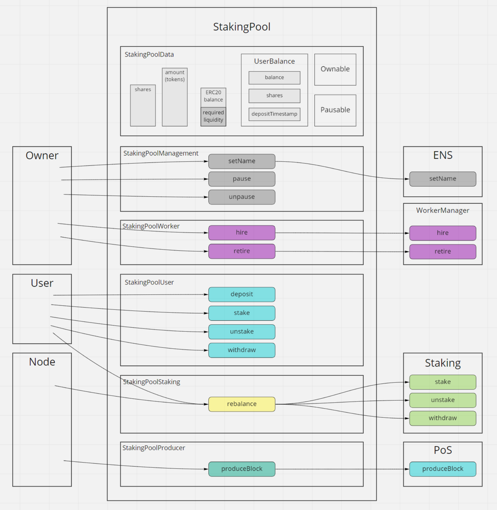
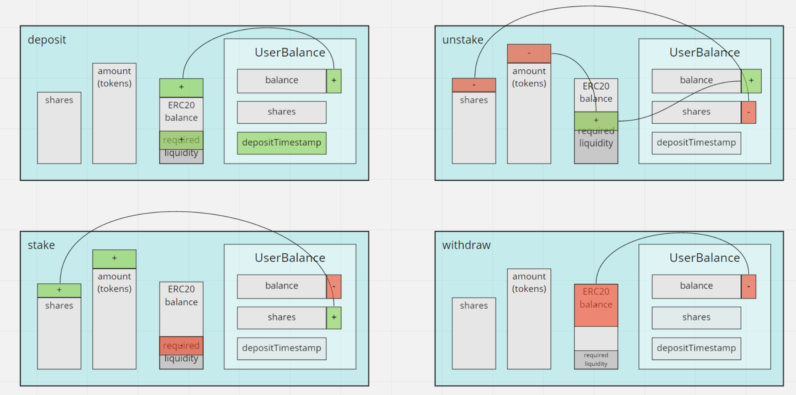
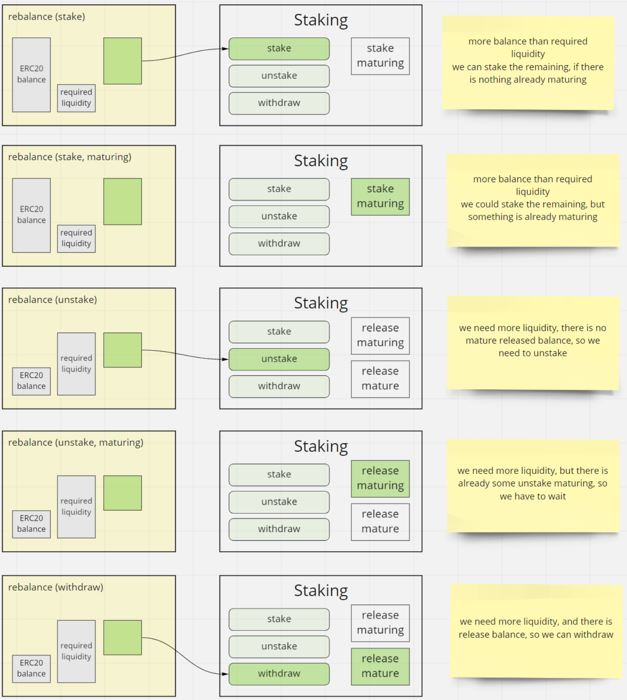
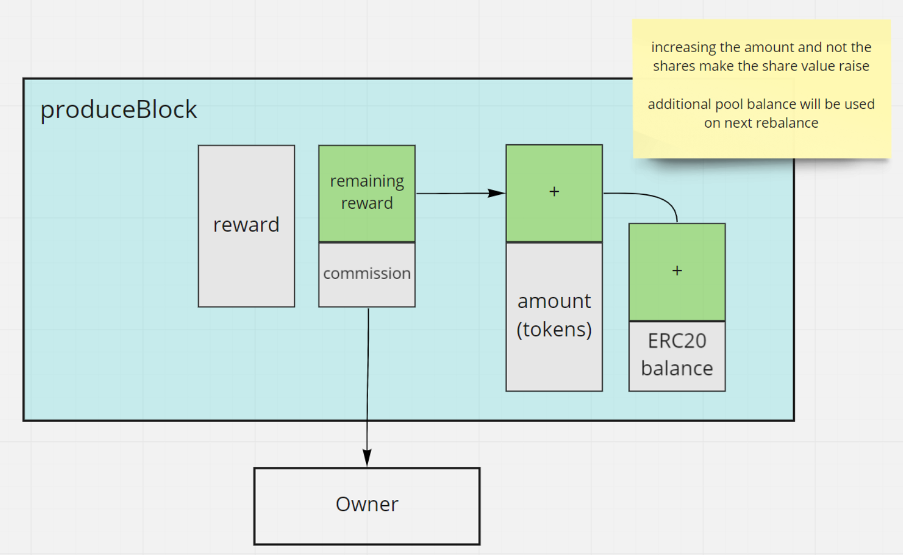
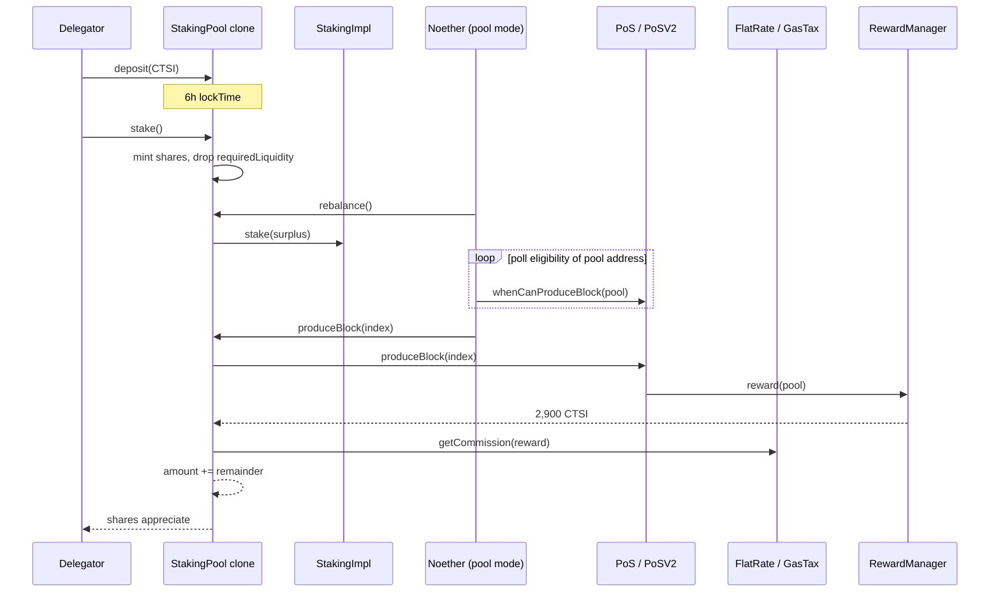

# staking-pool — Public staking pools

High-level tour of [cartesi/staking-pool](https://github.com/cartesi/staking-pool) (published as `@cartesi/staking-pool`). Local clone: `../staking-pool`.

This is the **delegation layer** on top of [pos-dlib](./pos-dlib.md). A pool is a regular PoS user: it stakes CTSI, hires a Noether worker, and produces blocks. Delegators deposit into the pool and hold **shares** instead of interacting with `StakingImpl` themselves.

The explorer, subgraph, and Noether pool-node mode sit around these contracts. They are not in this repo.

Per-function and share-math depth is deferred to later deep dives.

## What it does

Anyone can create a pool via the factory. Delegators lock CTSI in the pool; the operator runs a Noether node and pays Ethereum gas. When the pool wins a block, ~2,900 CTSI arrives at the pool. The operator takes a **commission**; the rest stays in the pool and **auto-compounds** by raising the CTSI-per-share rate. No extra claim step for delegators.

Pools inherit the same PoS clocks as a solo staker (6h stake maturation, 48h unstake release) **plus** a pool-side 6h lock between a user's `deposit` and `stake`. Overlapping requests can therefore take up to another 6h / 48h while `rebalance()` waits for the PoS clocks.



## Component map

```
  Delegator wallet                         Pool operator
        │                                        │
        │ deposit / stake / unstake / withdraw   │ create pool, hire node,
        │                                        │ pause, setName, set fee
        ▼                                        ▼
┌───────────────────────────────────────────────────────────────────┐
│                     StakingPoolImpl (EIP-1167 clone)              │
│  User │ Staking │ Worker │ Management │ Producer   + StakingPoolData │
└───┬─────────┬─────────┬──────────┬──────────────┬─────────────────┘
    │         │         │          │              │
    │         │         │          │              │ produceBlock()
    │         │         │          │              ▼
    │         │         │          │         PoS / PoSV2  (pos-dlib)
    │         │         │          │              │
    │         │         │ hire     │              │ reward → pool CTSI
    │         │         ▼          │              │
    │         │   WorkerAuth       │         Fee contract
    │         │   (@cartesi/util)  │         (FlatRate or GasTax)
    │         ▼                    │              │ commission to owner
    │    StakingImpl               │              │ remainder compounds
    │    (pos-dlib)                │
    ▼                              ▼
 CTSI ERC-20                 StakingPoolFactoryImpl
                             clones reference pool + deploys fee
```

A **reference** `StakingPoolImpl` is deployed once and left **paused** so nobody can stake into it. Each live pool is a cheap clone of that implementation, initialized with its own fee contract and PoS address.

## Contracts

### `StakingPoolFactoryImpl` — create a pool

Owner-configurable factory. Anyone (when not paused) calls one of:

| Method | Commission model |
| --- | --- |
| `createFlatRateCommission(rate)` | Fixed % of each block reward (`rate / 1e4`; e.g. 500 = 5%) |
| `createGasTaxCommission(gas)` | Gas units reimbursed via Chainlink (gas → ETH → CTSI) |

Both are `payable`. The factory:

1. Deploys a fresh fee contract with factory-wide raise limits.
2. `Clones.clone(referencePool)` — EIP-1167 minimal proxy.
3. `initialize(fee, pos)` then `transferOwnership` of pool **and** fee to the creator.
4. `selfhire()` so the pool is a PoS worker of itself.
5. Emits `NewFlatRateCommissionStakingPool` / `NewGasTaxCommissionStakingPool`.

Commission **model** is chosen at creation and cannot be swapped later. Values can still move (down freely; up with caps).

Factory owner can `setReferencePool`, `setPoSAddress`, and pause new pool creation. Existing pools keep working.

Mainnet factory: [`0x00B6110c111b626bfC226894992d1A4C4740C4dC`](https://etherscan.io/address/0x00B6110c111b626bfC226894992d1A4C4740C4dC).

Reference implementation: [`0x3F9A0B1A0B81473e051a26a039F730b28f02018B`](https://etherscan.io/address/0x3F9A0B1A0B81473e051a26a039F730b28f02018B).

### `StakingPoolImpl` — one contract, five facets

Not a diamond proxy. One Solidity contract that **inherits** five implementations plus shared `StakingPoolData`:

| Facet | File | Role |
| --- | --- | --- |
| **User** | `StakingPoolUserImpl` | Delegator `deposit` / `stake` / `unstake` / `withdraw` |
| **Staking** | `StakingPoolStakingImpl` | Permissionless `rebalance()` vs pos-dlib `StakingImpl` |
| **Worker** | `StakingPoolWorkerImpl` | `selfhire` / `hire` / `cancelHire` / `retire` |
| **Management** | `StakingPoolManagementImpl` | ENS name, pause deposits/stakes |
| **Producer** | `StakingPoolProducerImpl` | `produceBlock` → split commission vs compound |

Constructor args (immutable on the reference, shared by clones): CTSI, `StakingImpl`, worker manager, ENS, `stakeLock` (6h on mainnet). Clone-specific state is set in `initialize`.

### `StakingPoolData` — pool accounting

Shared storage:

| Field | Meaning |
| --- | --- |
| `amount` | CTSI economically in the pool (staked on PoS + waiting), used for share price |
| `shares` | Total shares outstanding |
| `requiredLiquidity` | CTSI that must stay liquid for deposits-not-yet-staked and pending withdrawals |
| `userBalance[user]` | Free `balance`, `shares`, `depositTimestamp` |
| `pos` | PoS contract this pool produces on |

Share conversion (WadRayMath): first depositor gets 1 CTSI → 10⁹ ray shares; later

\[
\text{shares issued} = \frac{\text{stakeValue} \times \text{totalShares}}{\text{totalAmount}}
\]

Rewards increase `amount` without minting shares, so each share is worth more. Newcomers get fewer shares per CTSI. Rounding is bounded; see the repo README for the uint256 safety argument.

### User facet — join and leave



| Step | Effect |
| --- | --- |
| `deposit(amount)` | Pulls CTSI; adds to user `balance` and `requiredLiquidity`; **resets** `depositTimestamp`. Paused = blocked. |
| `stake(amount)` | After `lockTime` (~6h), burns free balance, mints shares at current rate, drops `requiredLiquidity`. User earns rewards immediately. |
| `unstake(shares)` | Burns shares for CTSI at current rate into user `balance`; raises `requiredLiquidity`. **Not** paused (exits always allowed). |
| `withdraw(amount)` | Sends free balance to the wallet if the pool actually holds that CTSI. |

The 6h deposit→stake gap is anti-sniping: you cannot jump into a pool seconds before it produces a block.

If new deposits arrive while someone is leaving, the pool may already be liquid and that person can withdraw without waiting for PoS unstake.

### Staking facet — `rebalance()`



The pool is a client of pos-dlib `StakingImpl`. Users never call that contract. Instead `rebalance()` (permissionless) reads `amounts()`:

| Situation | Action |
| --- | --- |
| ERC-20 balance **>** `requiredLiquidity` and nothing maturing on PoS | `stake` the surplus |
| Surplus but PoS stake still maturing | **do nothing** (avoid resetting the 6h clock) |
| Balance **<** `requiredLiquidity`, nothing releasing | `unstake` the shortfall |
| Shortfall, tokens already releasing but not mature | wait |
| Shortfall, releasing matured | `withdraw` from PoS |
| Balance **==** `requiredLiquidity` | idle |

Noether pool nodes call this about every 30 seconds. If the operator disappears, **anyone** can call `rebalance()` so exits still complete.

### Worker facet — hire the node

PoS still wants an owner and a worker. At creation `selfhire()` makes the **pool contract** both: it hires itself and authorizes itself on PoS.

The operator then `hire(nodeAddress)` (payable, owner-only) so a Noether wallet is authorized. `cancelHire` / `retire` unwind that. `update()` (owner) re-points authorization if the factory's PoS address changed.

The node does **not** call `PoS.produceBlock` directly. It calls **`pool.produceBlock`**, and the pool (self-hired worker) forwards to PoS. Reward CTSI therefore lands on the pool, not the node wallet. The node still needs ETH for gas (produce + rebalance).

### Management facet

Owner-only:

- `setName(string)` — ENS reverse record (explorer display name).
- `pause` / `unpause` — stop **new** deposits and stakes. Unstake and withdraw stay open.

The reference implementation is constructed paused.

### Producer facet — one block



Noether (or anyone who can satisfy PoS worker checks via the pool) calls `produceBlock(index)`:

1. Read current prize from the chain's `RewardManager`.
2. `pos.produceBlock(index)` — CTSI arrives on the pool.
3. `fee.getCommission(index, reward)` — cap at 100% of the prize.
4. Transfer commission to `owner()`.
5. Add the remainder to `amount` (share price up; no new shares).
6. Emit `BlockProduced(reward, commission)`.

Uses the **v1** `IPoS.produceBlock(uint256)` ABI, which PoS v2 still implements in v1-compatible mode.

### Fee contracts

Separate, owned by the pool creator. `Fee.getCommission(posIndex, rewardAmount)`.

**`FlatRateCommission`** — `commission = reward * rate / 10_000`. Lower anytime. Raise: at most `maxRaise` (factory: **500 = 5%**) and only after `feeRaiseTimeout` (**7 days** on mainnet).

**`GasTaxCommission`** — `gas` units × Chainlink fast-gas price → ETH, then ÷ CTSI/ETH feed → CTSI, capped at the reward. Same raise rules with `maxRaise` of **20,000 gas**. Relies on:

| Oracle wrapper | Mainnet | Feed |
| --- | --- | --- |
| `ChainlinkGasOracle` | [`0x778e443D…27F2E`](https://etherscan.io/address/0x778e443DCe627dE31bbc54098cC8153508c27F2E) | Fast gas ([`0x169E633A…`](https://data.chain.link/fast-gas-gwei)) |
| `ChainlinkPriceOracle` | [`0xd092A361…a832a`](https://etherscan.io/address/0xd092A3611A140Bd4171ad46B5F708593E7fA832a) | CTSI/ETH ([`0x0a1d1b98…`](https://data.chain.link/ethereum/mainnet/crypto-eth/ctsi-eth)) |

Early drafts used Uniswap; v1.0.0-beta.1 switched to Chainlink. A beta.3 fix corrected CTSI/ETH vs ETH/CTSI inversion.

## How they interact (delegator + one block)



## Mainnet snapshot

| Contract | Address |
| --- | --- |
| `StakingPoolFactoryImpl` | [`0x00B6110c…C4dC`](https://etherscan.io/address/0x00B6110c111b626bfC226894992d1A4C4740C4dC) |
| `StakingPoolImpl` (paused reference) | [`0x3F9A0B1A…2018B`](https://etherscan.io/address/0x3F9A0B1A0B81473e051a26a039F730b28f02018B) |
| `ChainlinkGasOracle` | [`0x778e443D…7F2E`](https://etherscan.io/address/0x778e443DCe627dE31bbc54098cC8153508c27F2E) |
| `ChainlinkPriceOracle` | [`0xd092A361…832a`](https://etherscan.io/address/0xd092A3611A140Bd4171ad46B5F708593E7fA832a) |
| pos-dlib `StakingImpl` (pool client) | [`0x9EdEAdFD…4A69`](https://etherscan.io/address/0x9EdEAdFDE65BCfD0907db3AcdB3445229c764A69) |
| pos-dlib `PoS` (factory default) | [`0x20516624…4fcE`](https://etherscan.io/address/0x20516624DE3cbE267a514fE91c31477369524fcE) |

Individual pools are clones; look them up on [explorer.cartesi.io](https://explorer.cartesi.io) or factory `New*StakingPool` events. Factory constructor caps: raise timeout 7 days, max gas raise 20,000, max flat raise 5%.

Sepolia ABIs: `../staking-pool/export/abi/sepolia.json`.

## Tests (in-repo)

Hardhat suites under `test/`: factory, user, staking/rebalance, worker, producer, management, fees, reference-pool pause. Coverage via `yarn test:coverage`. No Foundry suite here (unlike pos-dlib).

## Audits and bounties

This repo is the one CertiK actually listed by filename. Same public sources as [pos-dlib](./pos-dlib.md#audits-and-bounties):

| When | Who | Scope (as published) | Link |
| --- | --- | --- | --- |
| Sep 2021 | **CertiK** | Delivered 22 Sep 2021. Skynet shows 10 files; visible names include `StakingPoolWorkerImpl.sol` and `FlatRateCommission.sol`. 14 findings (0 critical; 2 major, 4 medium, 5 minor, 3 informational); 8 resolved, 6 acknowledged. Matches the staking-delegation mainnet launch (`@cartesi/staking-pool` 1.0.0, 27 Sep 2021). | [Skynet: Cartesi](https://skynet.certik.com/projects/cartesi) · [report PDF](https://drive.google.com/file/d/1_sfIuiEjKSA1868FMTrEFY-vqpD23YhV/view) |
| 2021 | **Internal / advisors** | Advisor review alongside CertiK before mainnet beta. | [Mainnet-beta announcement](https://medium.com/cartesi/noethers-staking-delegation-mainnet-beta-is-now-live-3e8b4c712876) |
| Oct 2021 | **Immunefi** | Bounty on Noether PoS / staking (principal and yield). Critical rewards advertised up to **$500,000**. Original program URL now 404s. | [Launch post](https://medium.com/cartesi/cartesi-launches-bug-bounty-program-with-immunefi-to-harden-noethers-pos-31ae54c87939) |

Post-audit code changes of note: GasTax CTSI/ETH fix (1.0.0-beta.3, before mainnet 1.0.0). Later tagged releases (2.0.0, 2.1.x) are mostly dependency / network-list updates; changelog says **no pool logic change**. There is no second public CertiK pass after 2021.

## What to read next

- [pos-dlib](./pos-dlib.md) — the PoS contracts every pool is a client of
- [Key concepts](./key-concepts.md) — shares, rebalance, commissions, hiring
- [Intro to CTSI staking](./intro-ctsi-staking.md) — delegating vs running a private node
- User guide: [Create a public pool](https://docs.cartesi.io/earn-ctsi/public-pool)
- Repo README: [cartesi/staking-pool](https://github.com/cartesi/staking-pool/blob/master/README.md)
